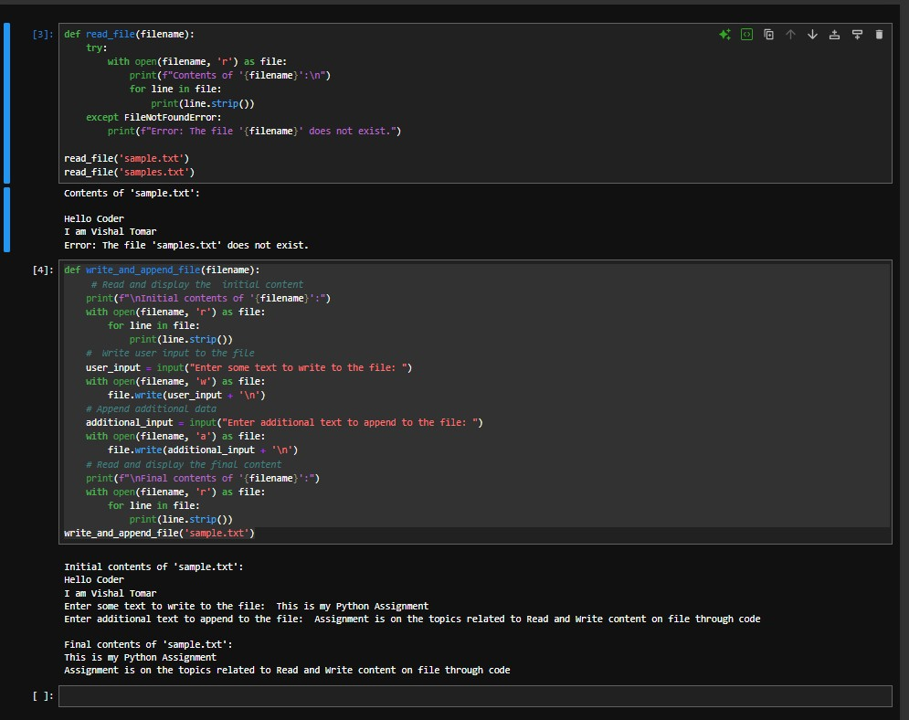

# Assignment 4: Files, Exceptions, and Errors in Python

This repository contains Python scripts for **Assignment 4**, which is based on **Module 5** of the Python course. It covers file handling, reading/writing files, and proper exception management.

---

## 📄 Task 1: Read a File and Handle Errors

### ✅ Problem Statement:
Create a Python program that:
1. Opens and reads a text file named `sample.txt`.
2. Prints its content line by line.
3. Gracefully handles errors if the file does not exist.

### 🔍 Expected Behavior:
- **If the file exists:** It displays each line of the file.
- **If the file does not exist:** It displays a user-friendly error message.

## ✍️ Task 2: Write and Append Data to a File

### ✅ Problem Statement:
Create a Python program that:
1. Takes user input and writes it to a file named `sample.txt`.
2. Appends additional user input to the same file.
3. Reads and displays the final content of the file.

### 🔍 Expected Behavior:
- Takes two inputs from the user.
- Writes and appends them.
- Prints the final contents of `sample.txt`.

## 📸 Screenshot

Please refer to the image below to see a sample run of both programs:

